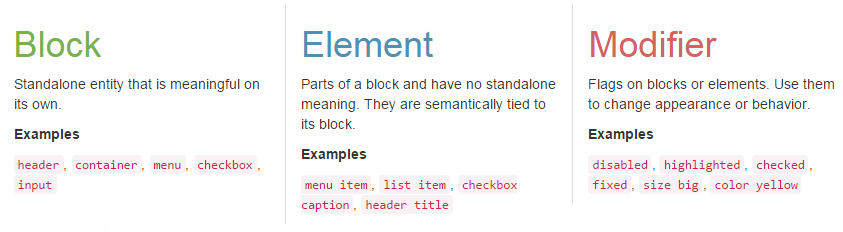

# Sass 样式文件目录

 - **base** 存放基础的配置文件
 - **components** 组件样式
 - **elements** 将组件细分，抽离出独立的元素样式
 - **utils** 辅助文件
 - **vendors** 外部 `Sass` 库文件
 - **page.scss** 用于生成样式的文件

前面五个都是文件夹，最后是一个文件。放在根目录的文件应当生成一个同名的 `.css` 文件，一般移动端的项目仅包含一个文件，PC 端可能包含多个；放在子目录中的文件都应当以下划线（`_`）为开头，也就是说不能直接用于生成 css 文件。

在实际项目中，base 中的文件只需要做少量修改；components 中的文件应当重新编写，少量可复用；elements 中的文件大部分都可以复用；utils 中的文件在平时不断积累，偶尔会有改动；venders 中的外部文件一旦引入后就不应该再变了，最常见的是引入 `Bootstrap` 。

参考文章：
 - [BEM. Block, Element, Modifier](https://en.bem.info/method/)
 - [Get BEM Introduction](http://getbem.com/introduction/)
 - [How to Scale and Maintain Legacy CSS with Sass and SMACSS](http://webuild.envato.com/blog/how-to-scale-and-maintain-legacy-css-with-sass-and-smacss/)
 - [How to structure a Sass project](http://thesassway.com/beginner/how-to-structure-a-sass-project) [（译文）](http://www.w3cplus.com/preprocessor/beginner/how-to-structure-a-sass-project.html)
 - [Architecture for a Sass Project](http://www.sitepoint.com/architecture-sass-project/) [（译文）](http://www.w3cplus.com/preprocessor/architecture-sass-project.html)
 - [A Look at Different Sass Architectures](http://www.sitepoint.com/look-different-sass-architectures/)

我是根据这些文章总结出来一个自己觉得好用的文件管理方法，是 **个性化**，而不是 **优化**。分层相对简单，不可能面面俱到，也不一定适合大项目。

接着依次介绍各个子目录应当包含的文件。

### base

 - **base/**
    - **_normalize.scss** 屏蔽浏览器样式差异
    - **_reset.scss** 重置部分 `HTML` 标签的样式
    - **_settings.scss** 项目配置
    - **_themes.scss** 页面主题（配色）配置文件
    - **_typography.scss** 页面版式（布局）配置文件

##### _normalize.scss
来自开源项目 [kristerkari/normalize.scss](https://github.com/kristerkari/normalize.scss) ，这个项目是 [necolas/normalize.css](https://github.com/necolas/normalize.css) 的 SCSS 版本。

由于这个文件主要是为了解决旧浏览器的样式差异，所以对其版本更新要求不高，直接复制过来放在 base 内，而不是放在 vendors 中。

##### _reset.scss
用于重置 HTML 现有标签的样式。例如去除 `<ul>` 和 `<ol>` 的列表样式、去除 `<a>` 的下划线、统一标签的盒模型（`content-box` 或 `border-box`）等。

##### _settings.scss
项目总体配置文件，它引用了 `_themes.scss` 的 `_typography.scss` 两个文件，还定义了一写全局变量和配置。如默认字体、是否生成动画等。

##### _themes.scss
管理页面配色方案，语义化页面中的颜色，用函数的方式进行读取。这样能保证页面中颜色保持一致，而且方便统一修改配色方案。（具体实现方式在其他文档中介绍。）

##### _typography.scss
定义全局的布局参数，例如网站头部高度、导航条高度、侧边栏宽度。只定义全局的、共用的布局参数，具体组件内部的布局由组件自行配置。目前仅是通过定义变量的方式实现，以后可能会和 themes 文件一样，封装进一个函数内部。

### components
定义页面中组件级别的样式，但是并不直接生成代码，只定义 `mixin` ，在页面需要用到该组件时，显式的 `@include`。也可以将指定组件打包独立输出为公共文件，不必涉及页面细节。

在这里定义的“组件”，仅仅是在本网站中会复用的，而不是像 Bootstrap 那样为了适用于所有项目而设计。

例如 *登录框*、*导航条*、*文章排版*、*友情链接* ，各个网站都不相同，但是同一个网站不应该有两种样式，哪怕是阴影大小也应该全部保持一致。这个划分方式对应的是 [BEM](https://en.bem.info/method/) 中的 **Block** ：

 > A block is an independent entity, a "building block" of an application. A block can be either simple or compound (containing other blocks).

而且，一些细粒度的 Block 还可以拼成更大的 Block。

 > Blocks may also be contained inside other blocks.

### elements

同样，elements 也是参考的 BEM ：

 > An element is a part of a block that performs a certain function. Elements are context-dependent: they only make sense in the context of the block they belong to.

元素的编写就更加抽象化了，只能用 `mixin` 实现，而且必须提供灵活的配置参数。例如一个按钮、输入框、tips、flag 等。

### utils
存放一些辅助性的函数、mixin 和 palceholder ，用于提高编写效率。

##### _effective.scss
某些常用样式的快捷写法，如清除浮动、使超出的文字以 `...` 显示、添加边框的快速写法、用CSS画三角形等。

##### _function.scss
辅助函数，如求平方根和斐波那契数列（是的，我竟然还真的用到了）。

##### _diagnostic.scss
检测页面中编写不规范的标签，通过添加背景色的边框的方式突出显示。只能简单检查个别标签使用不规范的地方，不涉及到语义。

参考：[CSS Tools: Diagnostic CSS](http://meyerweb.com/eric/tools/css/diagnostics/)

##### _animation.scss
将一些常见动画效果封装进函数。细节见其他文档。
